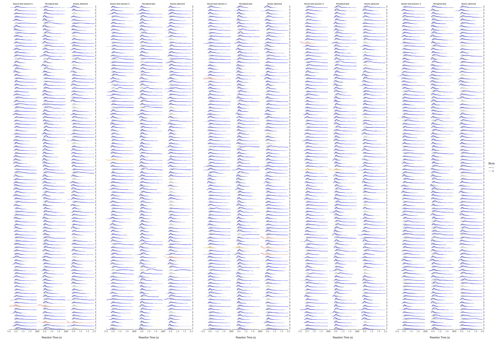

```{r, echo = FALSE, warning=FALSE, message=FALSE}
options(
  digits = 3,
  mc.cores = 4,
  brms.algorithm = "sampling",
  brms.backend = "cmdstanr",
  dplyr.summarise.inform = FALSE,
  knitr.kable.NA = ""
)

cache <- FALSE
runModels <- FALSE
bestModels <- TRUE
fig.width <- 6 * sqrt(2) # see::golden_ratio(7)
fig.height <- 6

knitr::opts_chunk$set(
  collapse = TRUE,
  dpi = 300,
  fig.path = "./figures/1_Preprocessing-",
  fig.width = fig.width,
  fig.height = fig.height
)
```

# Preprocessing


```{r message=FALSE, warning=FALSE}
library(tidyverse)
library(ggdist)
library(ggside)
library(easystats)
library(patchwork)

illusion1 <- read.csv("../data/raw_illusion1.csv") |>
  mutate(
    Illusion_Effect = fct_relevel(as.factor(Illusion_Effect), "Incongruent", "Congruent"),
    Block = as.factor(Block)
  )

illusion2 <- read.csv("../data/raw_illusion2.csv") |>
  mutate(
    Illusion_Effect = fct_relevel(as.factor(Illusion_Effect), "Incongruent", "Congruent"),
    Block = as.factor(Block)
  )

perceptual <- read.csv("../data/raw_perceptual.csv") |>
  mutate(
    Block = as.factor(Block)
  )

sub <- read.csv("../data/raw_questionnaires.csv") |> 
  mutate(
    Education = fct_relevel(Education, "Prefer not to say", "Other", "High school", "Bachelor", "Master", "Doctorate")
  )

# For prolific:
# bayestestR::point_estimate(sub$Duration_Session1)
# plot(bayestestR::estimate_density(sub$Duration_Session1))
```


# Outlier Detection (Tasks) {.tabset}


```{r message=FALSE, warning=FALSE}
# Dear participant, thank you for participating in our study. Unfortunately, our system detected multiple issues in your data (such as implausibly short responses - in particular in the 2nd part of the study, random-like pattern of answers, or the same response to different scales - as some were designed to trigger various answers), which makes it unusable. We understand that you might have been in a hurry or had some other issues, and so we kindly ask you to return your participation; we hope to open-up more slots in the future would you be interested to participate again. 

# Dear participant, thank you for participating in our study. Unfortunately, our system detected multiple issues in your data (such as implausibly short responses - in particular in the 2nd part of the study, random-like pattern of answers, or the same response to different scales - as some were designed to trigger various answers), which makes it unusable for us. We understand that you might have been in a hurry or had some other issues; we hope to open-up more slots in the future would you be interested to participate again. 

outliers_perceptual <- c(
  "S003",
  "S008"
)
outliers_perceptual_block2 <- c(
  "S226",
  "S350"
)
outliers_illusion1 <- c(
  "S008",
  "S278",
  "S389"
  )
outliers_illusion1_block2 <- c(
  "S153",
  "S226",
  "S350"
  )
outliers_illusion2 <- c(
  "S003",
  "S123",
  "S224",
  "S226",
  "S229"
)
```

We removed `r length(outliers_illusion1)`, `r length(outliers_perceptual)`, and `r length(outliers_illusion2)` participants for the illusion task - session 1, perceptual task, and illusion task - session 2 respectively, upon inspection of the average error rage (when close to 50%, suggesting random answers) and/or when the reaction time distribution was implausibly fast. 


### Descriptive Table

```{r message=FALSE, warning=FALSE}
data <- rbind(illusion1, illusion2, perceptual) |>
  filter(RT < 10) |>
  mutate(
    Participant = fct_rev(Participant),
    Task = fct_relevel(Task, "Illusion_Session1", "Perceptual", "Illusion_Session2")
  )

table <- data |>
  group_by(Participant, Task) |>
  summarize(
    Error = sum(Error) / n(),
    RT = mean(RT)
  ) |>
  ungroup() |>
  arrange(desc(Error)) |>
  tidyr::pivot_wider(names_from = "Task", values_from = c("Error", "RT"), names_vary = "slowest") |>
  datawizard::data_relocate(ends_with("Session2"), after = -1) |>
  datawizard::data_relocate(ends_with("Session1"), after = 1) |>
  arrange(desc(Error_Illusion_Session1))
```


```{r message=FALSE, warning=FALSE}
data.frame(Participant = c("Average"), t(sapply(table[2:ncol(table)], mean, na.rm = TRUE))) |>
  rbind(table) |>
  knitr::kable() |>
  kableExtra::row_spec(1, italic = TRUE, background = "grey", color = "white") |>
  kableExtra::row_spec(which(table$Participant %in% c(outliers_perceptual, outliers_illusion1, outliers_illusion2)) + 1, background = "#EF9A9A") |>
  kableExtra::row_spec(which(table$Participant %in% c(outliers_illusion1_block2, outliers_perceptual_block2)) + 1, background = "orange") |>
  # kableExtra::column_spec(2, color="white",
  #                         background = kableExtra::spec_color(c(NA, table$Error_Illusion_Session1))) |>
  kableExtra::kable_styling(full_width = TRUE) |>
  kableExtra::scroll_box(width = "100%", height = "500px")
```

### Reaction Time Distribution


```{r message=FALSE, warning=FALSE, cache=cache, eval=FALSE}
plot_distribution <- function(data) {
  data |>
    estimate_density(select = "RT", at = c("Participant", "Task", "Block")) |>
    group_by(Participant) |>
    normalize(select = "y") |>
    ungroup() |>
    mutate(
      # Participant = fct_relevel(Participant, as.character(table$Participant)),
      color = case_when(
        Participant %in% outliers_perceptual & Task == "Perceptual" ~ "red",
        Participant %in% outliers_illusion1 & Task == "Illusion_Session1" ~ "red",
        Participant %in% outliers_illusion2 & Task == "Illusion_Session2" ~ "red",
        Participant %in% outliers_perceptual_block2 & Task == "Perceptual" ~ "orange",
        Participant %in% outliers_illusion1_block2 & Task == "Illusion_Session1" ~ "orange",
        TRUE ~ "blue"
      ),
      Task = fct_recode(Task,
        "Illusion task (session 1)" = "Illusion_Session1",
        # "Illusion task (session 2)" = "Illusion_Session2",
        "Perceptual task" = "Perceptual"
      )
    ) |>
    ggplot(aes(x = x, y = y)) +
    geom_area(data = normalize(estimate_density(data, select = "RT"), select = "y"), alpha = 0.2) +
    geom_line(aes(color = color, group = interaction(Participant, Block), linetype = Block), size = 0.5) +
    # geom_vline(xintercept = 0.125, linetype = "dashed", color = "red", size = 0.5) +
    scale_color_manual(values = c("red" = "#F44336", "orange" = "#FF9800", "blue" = "blue"), guide = "none") +
    scale_x_continuous(expand = c(0, 0)) +
    scale_y_continuous(expand = c(0, 0)) +
    coord_cartesian(xlim = c(0, 2)) +
    theme_modern() +
    theme(axis.text.y = element_blank(),
          axis.line.y = element_blank(),
          strip.text.y = element_text(size = rel(0.6))) +
    facet_grid(Participant ~ Task) +
    labs(y = "", x = "Reaction Time (s)")
}

p <- list()
for(i in 1:5) {
  p[[i]] <- data |>
  filter((as.numeric(gsub("\\D", "", Participant)) > (i - 1) * 100) & (as.numeric(gsub("\\D", "", Participant)) <= 100 * i)) |>
  plot_distribution()
}
p <- patchwork::wrap_plots(p, ncol=5, nrow=1) + plot_layout(guides = "collect")
ggsave("figures/1_Preprocessing-p_outliers_RT.png", p, width = 7*5, height = 24, dpi = 150)
```
```{r message=FALSE, warning=FALSE, cache=cache, out.width="100%"}

```


```{r message=FALSE, warning=FALSE}
illusion1 <- filter(illusion1, !Participant %in% outliers_illusion1)
illusion1 <- filter(illusion1, !(Participant %in% outliers_illusion1_block2 & Block == 2))
illusion2 <- filter(illusion2, !Participant %in% outliers_illusion2)
perceptual <- filter(perceptual, !Participant %in% outliers_perceptual)
perceptual <- filter(perceptual, !(Participant %in% outliers_perceptual_block2 & Block == 2))
```


# Outliers Detection (Blocks)

For each block, we computed the error rate and, if more than 50%, we discarded the whole block (as it likely indicates that instructions got mixed up, for instance participants were selecting the smaller instead of the bigger circle).

```{r p_outliers_errorblock, message=FALSE, warning=FALSE}
data <- rbind(illusion1, illusion2, perceptual) |>
  group_by(Participant, Task, Illusion_Type, Block) |>
  summarize(ErrorRate_per_block = sum(Error) / n()) |>
  ungroup() |>
  arrange(desc(ErrorRate_per_block))


data |>
  estimate_density(at = c("Task", "Illusion_Type", "Block"), method = "KernSmooth") |>
  ggplot(aes(x = x, y = y)) +
  geom_line(aes(color = Illusion_Type, linetype = Block)) +
  geom_vline(xintercept = 0.5, linetype = "dashed") +
  scale_x_continuous(expand = c(0, 0)) +
  scale_y_continuous(expand = c(0, 0)) +
  scale_color_manual(values = c("Ebbinghaus" = "#2196F3", "MullerLyer" = "#4CAF50", "VerticalHorizontal" = "#FF5722")) +
  labs(y = "Distribution", x = "Error Rate") +
  theme_modern() +
  facet_wrap(~Task)
```

```{r message=FALSE, warning=FALSE, results='asis'}
remove_badblocks <- function(df) {
  n <- nrow(df)
  df <- df |>
    group_by(Participant, Illusion_Type, Block) |>
    mutate(ErrorRate_per_block = sum(Error) / n()) |>
    ungroup() |>
    filter(ErrorRate_per_block < 0.5) |>
    select(-ErrorRate_per_block)
  
  text <- paste0(
    "We removed ",
    n - nrow(df),
    " (",
    insight::format_value((n - nrow(df)) / n, as_percent = TRUE),
    ") trials belonging to bad blocks."
  )
  list(data = df, text = text)
}

out <- remove_badblocks(illusion1)
print(paste("Illusion (session 1):", out$text))
illusion1 <- out$data

out <- remove_badblocks(illusion2)
print(paste("Illusion (session 2):", out$text))
illusion2 <- out$data

out <- remove_badblocks(perceptual)
print(paste("Perceptual task:", out$text))
perceptual <- out$data
```


# Outliers Detection (Trials)

## Reaction Time per Trial {.tabset}

```{r outliers_RTtrials, message=FALSE, warning=FALSE}
check_trials <- function(df) {
  data <- df |>
    mutate(Outlier = ifelse(RT >= 10, TRUE, FALSE)) |>
    group_by(Participant) |>
    mutate(Outlier = ifelse(RT < 0.125 | standardize(RT, robust = TRUE) > 4, TRUE, Outlier)) |>
    ungroup()

  p1 <- data |>
    filter(RT < 10) |>
    estimate_density(select = "RT", at = "Participant") |>
    group_by(Participant) |>
    normalize(select = "y") |>
    ungroup() |>
    merge(data |>
      group_by(Participant) |>
      mutate(Threshold = median(RT) + 4 * mad(RT)) |>
      filter(Error == 0) |>
      summarize(Threshold = mean(Threshold))) |>
    mutate(Outlier = ifelse(x >= Threshold, TRUE, FALSE)) |>
    ggplot(aes(x = x, y = y)) +
    geom_area(data = normalize(estimate_density(filter(data, RT < 10), select = "RT"), select = "y"), alpha = 0.2) +
    geom_line(aes(color = Participant, linetype = Outlier), alpha = 0.2) +
    geom_vline(xintercept = c(125), linetype = "dashed", color = "red") +
    scale_color_material_d("rainbow", guide = "none") +
    scale_x_continuous(expand = c(0, 0)) +
    scale_y_continuous(expand = c(0, 0)) +
    guides(linetype = "none") +
    coord_cartesian(xlim = c(0, 5)) +
    theme_modern() +
    theme(axis.text.y = element_blank()) +
    labs(y = "", x = "Reaction Time (s)")


  p2 <- data |>
    group_by(Participant) |>
    summarize(Outlier = sum(Outlier) / nrow(illusion1)) |>
    mutate(Participant = fct_reorder(Participant, Outlier)) |>
    ggplot(aes(x = Participant, y = Outlier)) +
    geom_bar(stat = "identity", aes(fill = Participant)) +
    scale_fill_material_d("rainbow", guide = "none") +
    scale_x_discrete(expand = c(0, 0)) +
    scale_y_continuous(expand = c(0, 0), labels = scales::percent) +
    see::theme_modern() +
    theme(axis.text.x = element_blank()) +
    labs(y = "Percentage of outlier trials")

  text <- paste0(
    "We removed ",
    sum(data$Outlier),
    " (",
    insight::format_value(sum(data$Outlier) / nrow(data), as_percent = TRUE),
    ") outlier trials (125 ms < RT < 4 MAD above median)."
  )

  data <- filter(data, Outlier == FALSE)
  data$Outlier <- NULL

  list(p = p1 / p2, data = data, text = text)
}
```

### Illusion Task (Session 1)

```{r p_outliers_RTtrials_session1, message=FALSE, warning=FALSE, results='asis'}
out <- check_trials(illusion1)
print(paste("Illusion (session 1):", out$text))
out$p
illusion1 <- out$data
```


### Illusion Task (Session 2)

```{r p_outliers_RTtrials_session2, message=FALSE, warning=FALSE, results='asis'}
out <- check_trials(illusion2)
print(paste("Illusion (session 2):", out$text))
out$p
illusion2 <- out$data
```


### Perceptual Task

```{r p_outliers_RTtrials_perceptual, message=FALSE, warning=FALSE, results='asis'}
out <- check_trials(perceptual)
print(paste("Perceptual task:", out$text))
out$p
perceptual <- out$data
```


# Outlier Detection (Questionnaires)

## Multivariate Detection

We compute a multivariate outlier score.

```{r message=FALSE, warning=FALSE}
outliers <- sub |> 
  select(AttentionCheck_Session1, 
         IPIP6_RT, PID5_RT, GCBS_RT, ASQ_RT, LIE_RT, SPQ_RT, 
         IPIP6_SD, PID5_SD, GCBS_SD, ASQ_SD, LIE_SD, SPQ_SD, 
         PHQ4_SD) |> 
  standardize() |> 
  performance::check_outliers(method = c("mahalanobis", "mahalanobis_robust", "mcd", "ics"))

sub$Outlier_Questionnaire <- as.data.frame(outliers)$Outlier
# outliers
```

## Manual Check

```{r message=FALSE, warning=FALSE}
# < 0.80 to the average attention check and 1 in outlier score
outliers_questionnaires <- c(
  "S003", "S008", "S047", "S068", "S110", "S127", "S151", "S189", "S261", "S266", "S390", "S489", "S494"
)
```

We removed the questionnaire data from `r length(outliers_questionnaires)` participants upon inspection of attention checks and time taken to complete each questionnaires.

```{r message=FALSE, warning=FALSE}
table <- sub |>
  mutate(
    Outlier_Task1 = Participant %in% outliers_illusion1,
    Outlier_Task1b = Participant %in% outliers_illusion1_block2 / 2,
    Outlier_Task2 = Participant %in% outliers_illusion2,
    Outlier_Task3 = Participant %in% outliers_perceptual,
    Outlier_Task3b = Participant %in% outliers_perceptual_block2 / 2,
    Outlier_Tasks = Outlier_Task1 + Outlier_Task1b + 
      Outlier_Task2 + 
      Outlier_Task3 + Outlier_Task3b
  ) |>
  select(
    Participant,
    Outlier_Tasks,
    Outlier_Questionnaire,
    AttentionCheck_Session1,
    IPIP6_RT, PID5_RT, ASQ_RT, SPQ_RT,
    IPIP6_SD, PID5_SD, PHQ4_SD,
    AttentionCheck_Session2,
    BPD_RT, MAIA_RT, PI_RT,
    BPD_SD, MAIA_SD, PI_SD
  ) |> 
  # mutate(across(ends_with("IPIP6_RT") | ends_with("IPIP6_SD"), standardize)) |> 
  # arrange(desc(Outlier_Tasks), AttentionCheck_Session1) 
  arrange(desc(Participant))
```


```{r message=FALSE, warning=FALSE}
t <- data.frame(Participant = c("Average"), t(sapply(table[2:ncol(table)], mean, na.rm = TRUE))) |>
  rbind(table) |>
  knitr::kable() |>
  kableExtra::row_spec(1, italic = TRUE) |>
  kableExtra::row_spec(which(table$Participant %in% outliers_questionnaires) + 1, background = "#EF9A9A")

for (i in 2:ncol(table)) {
  t <- kableExtra::column_spec(
    t, i,
    color = "white",
    background = kableExtra::spec_color(
      c(NA, table[[i]]),
      option = "D",
      alpha = 1,
      # direction = ifelse(str_detect(names(table)[i], "_SD|Outlier"), 1, -1),
      na_color = "white",
    )
  )
}


t  |>
  kableExtra::row_spec(1, background = "grey") |> 
  kableExtra::kable_styling(full_width = TRUE, font_size = 9) |>
  kableExtra::scroll_box(width = "100%", height = "500px")

# Inspection: select(sub[sub$Participant == "S199", ], starts_with("AttentionCheck"))
```


```{r message=FALSE, warning=FALSE}
sub[
  sub$Participant %in% outliers_questionnaires,
  names(sub)[!names(sub) %in% c(
    "Participant", "Nationality", "Age",
    "Ethnicity", "Sex", "Student", "Education",
    "Interval", "AttentionCheck_Session1",
    "AttentionCheck_Session2"
  )]
] <- NA
```


# Final Sample

We collected data from `r nrow(sub)` participants.

```{r message=FALSE, warning=FALSE}
illusion1 <- illusion1[!illusion1$Participant %in% outliers_illusion1, ]
illusion2 <- illusion2[!illusion2$Participant %in% outliers_illusion1, ]
perceptual <- perceptual[!perceptual$Participant %in% outliers_illusion1, ]
sub <- sub[!sub$Participant %in% outliers_illusion1, ]
```

The final sample included `r report::report_participants(sub, age="Age", sex="Sex")`, from which `r sum(!is.na(sub$Interval))` (`r insight::format_percent(sum(!is.na(sub$Interval)) / nrow(sub))`) completed session 2.

## Country of Origin

```{r p_demographics_country, message=FALSE, warning=FALSE, dpi=200}
p_country <- select(sub, region = Nationality) |>
  group_by(region) |>
  summarize(n = n()) |>
  right_join(map_data("world"), by = "region") |>
  ggplot(aes(long, lat, group = group)) +
  geom_polygon(aes(fill = n)) +
  scale_fill_gradientn(colors = c("#FFEB3B", "red", "purple")) +
  labs(fill = "N") +
  theme_void() +
  labs(title = "Origin", subtitle = "N participants by country")  +
  theme(
    plot.title = element_text(size = rel(1.2), face = "bold", hjust = 0),
    plot.subtitle = element_text(size = rel(1.2))
  )
p_country
```

## Age

```{r p_demographics_age, message=FALSE, warning=FALSE, dpi=200}
p_age <- estimate_density(sub$Age) |>
  normalize(select = y) |> 
  mutate(y = y * 86) |>  # To match the binwidth
  ggplot(aes(x = x)) +
  geom_histogram(data=sub, aes(x = Age), fill = "#616161", bins=28) +
  geom_line(aes(y = y), color = "orange", linewidth=2) +
  geom_vline(xintercept = mean(sub$Age), color = "red", linewidth=1.5) +
  geom_label(data = data.frame(x = mean(sub$Age) * 1.15, y = 0.95 * 75), aes(y = y), color = "red", label = paste0("Mean = ", format_value(mean(sub$Age)))) +
  scale_x_continuous(expand = c(0, 0)) +
  scale_y_continuous(expand = c(0, 0)) +
  labs(title = "Age", y = "Number of Participants", color = NULL, subtitle = "Distribution of participants' age") +
  theme_modern(axis.title.space = 10) +
  theme(
    plot.title = element_text(size = rel(1.2), face = "bold", hjust = 0),
    plot.subtitle = element_text(size = rel(1.2), vjust = 7),
    axis.text.y = element_text(size = rel(1.1)),
    axis.text.x = element_text(size = rel(1.1)),
    axis.title.x = element_blank()
  )
p_age
```


## Ethnicity

```{r p_demographics_ethnicity, message=FALSE, warning=FALSE, dpi=200}
plot_waffle <- function(sub, what = "Nationality", title = what, rows = 8, size = 3) {
  ggwaffle::waffle_iron(sub, what, rows = rows) |>
    ggplot(aes(x, y)) +
    geom_point(aes(color = group), shape = "square", size = size) +
    coord_equal() +
    ggtitle(title) +
    labs(fill = "", color = "", subtitle = "N participants per self-declared group") + # (each square represents one participant)"
    theme_void() +
    theme(
      plot.title = element_text(size = rel(1.2), face = "bold", hjust = 0),
      plot.subtitle = element_text(size = rel(1.2)),
      legend.key.height = unit(1, "mm"),
      legend.key.width = unit(1, "mm")
    )
}

p_ethni <- plot_waffle(sub, "Ethnicity", rows = 20, size = 8) +
  scale_color_manual(values = c("Hispanic" = "#FF5722", "Caucasian" = "#2196F3", "African" = "#4CAF50", "Asian" = "#FFC107", "Other" = "#795548"))
p_ethni
```


## Education

```{r p_demographics_education, message=FALSE, warning=FALSE, dpi=200}
p_edu <- sub |>
  ggplot(aes(x = Education)) +
  geom_bar(aes(fill = Education)) +
  scale_y_continuous(expand = c(0, 0), breaks= scales::pretty_breaks()) +
  scale_fill_viridis_d(guide = "none") +
  labs(title = "Education", y = "Number of Participants", subtitle = "N participants per achieved education level") +
  theme_modern(axis.title.space = 15) +
  theme(
    plot.title = element_text(size = rel(1.2), face = "bold", hjust = 0),
    plot.subtitle = element_text(size = rel(1.2), vjust = 7),
    axis.text.y = element_text(size = rel(1.1)),
    axis.text.x = element_text(size = rel(1.1)),
    axis.title.x = element_blank()
  )
p_edu
```


```{r p_demographics, message=FALSE, warning=FALSE, fig.height=12, fig.width=12 * sqrt(2)}
load_plot <- function(x) patchwork::wrap_elements(grid::rasterGrob(png::readPNG(x), interpolate = TRUE))

p <- (
  load_plot("figures/1_Preprocessing-p_demographics_country-1.png") |
    load_plot("figures/1_Preprocessing-p_demographics_age-1.png")) / (
  load_plot("figures/1_Preprocessing-p_demographics_ethnicity-1.png") |
    load_plot("figures/1_Preprocessing-p_demographics_education-1.png")
) + plot_annotation(title = "Demographic Information", subtitle = paste0("N = ", nrow(sub), " (49.9% ♀)"),
                    theme = theme(plot.title = element_text(size = rel(1.5), face = "bold", hjust = 0.5),
                                  plot.subtitle = element_text(size = rel(1.1), face = "italic", hjust = 0.5)))
p
ggsave("figures/figure_demographics.png", p, width = 12 * sqrt(2), height=12)
```

# Save Preprocessed

```{r message=FALSE, warning=FALSE}
write.csv(illusion1, "../data/preprocessed_illusion1.csv", row.names = FALSE)
write.csv(illusion2, "../data/preprocessed_illusion2.csv", row.names = FALSE)
write.csv(perceptual, "../data/preprocessed_perceptual.csv", row.names = FALSE)
write.csv(sub, "../data/preprocessed_questionnaires.csv", row.names = FALSE)
```
